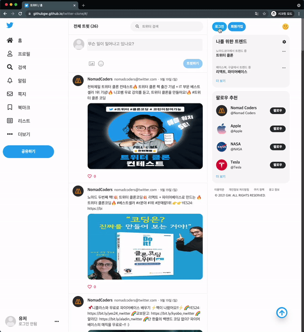
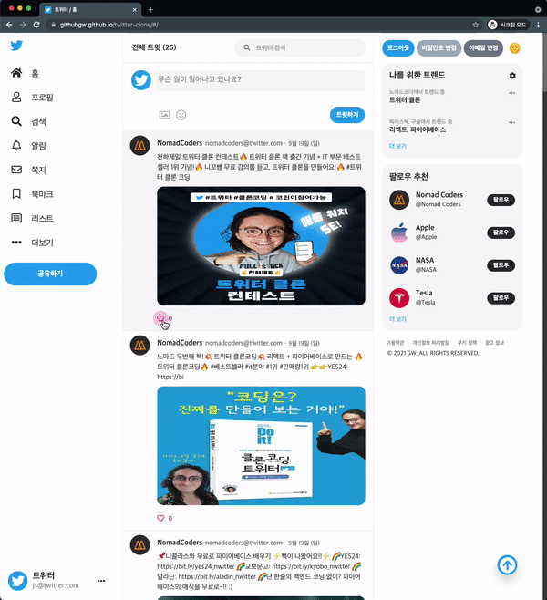

# Twitter-Clone

## 🔗 Demo
http://githubgw.github.io/twitter-clone

## 🖥 Preview

## 🔥 Stack

### Front-end

 

### Back-end

## ✅ Packages

- [x] React
- [x] React Router
- [x] React Hooks
- [x] Firebase
- [x] Styled Components

## ⚙ Features

- [x] Tweet CRUD
- [x] Email, Google, Github, Social Authentication
- [x] File Upload
- [x] Profile Page
- [x] Protected Pages
- [x] API Key Security
- [x] Deploy

## 🧑🏻‍💻 Services 

- [x] Firebase
- [x] Authentication
- [x] Cloud Firestore
- [x] Cloud Storage
- [x] Hosting
- [x] NoSQL Realtime, Query, Filter

## 📌 소개

### 1. 인증

#### 1-1. 비로그인 사용자도 읽기 허용
- 기존에 로그인을 한 후에만 트윗을 읽기와 쓰기가 가능한 방식에서 비로그인시에도 읽기까지는 가능하도록 변경하였습니다.
- 로그인을 하지 않아도 사이트에 들어와서 방문자가 간단하게 글을 읽고 확인하고 구경할 수 있도록 하였습니다.

#### 1-2. 회원가입, 이메일 로그인, 소셜 로그인(구글, 깃허브)
- 사용자가 이메일 또는 기존에 가지고 있던 구글이나 깃허브 소셜 계정을 통해 회원가입을 하고 로그인을 할 수 있습니다.
- 회원가입을 할 때 사용자 이름을 통해 초기 기본 닉네임을 설정할 수 있습니다.

#### 1-3. 이메일 주소 및 비밀번호 변경
- 회원가입 후 현재 로그인한 사용자가 이메일 변경 및 비밀번호 변경 버튼을 눌러 새로운 이메일 주소와 비밀번호로 변경할 수 있도록 하였습니다.
- 이메일 변경과 비밀번호 변경 버튼은 파이어베이스의 Auth를 통해 현재 로그인한 사용자가 인될 때만 버튼이 보여지도록 하였습니다.
- 새로운 이메일 주소를 변경할 때, 기존에 회원가입했던 이메일 주소를 통해 인증을 받아야만 변경할 수 있는 방법도 있습니다.

### 2. 유저

#### 2-1. 사용자 정보 확인
- 프로필 페이지에서 사용자가 가입한 이메일 주소와 계정 생성일, 마지막 로그인 날짜를 확인할 수 있도록 하였습니다.
- 또한 사용자가 가입한 이메일이 인증된 이메일인지도 확인할 수 있습니다.

#### 2-2. 사용자 이름 변경 및 프로필 사진 변경
- 프로필 페이지에서 사용자 이름과 프로필 사진을 변경하고 업로드할 수 있습니다.

#### 2-3. 사용자가 작성한 트윗 목록
- 프로필 페이지에서 사용자가 작성한 트윗 목록을 한 눈에 모아볼 수 있도록 하였습니다.
- 사용자는 자신이 작성한 트윗 정보와 작성한 트윗의 수를 확인할 수 있습니다.

### 3. 트윗

#### 3-1. 트윗 작성, 수정, 삭제
- 글, 이미지, 움짤 등을 넣어 트윗을 작성할 수 있도록 하였습니다.
- 사용자는 자신이 작성한 트윗을 클릭해서 수정하고 삭제할 수 있습니다.

#### 3-2. 이모지 추가
- 사용자가 이모지를 추가할 때 단축키를 사용하지 않고 아이콘을 클릭해서 원하는 이모지를 선택해 추가할 수 있도록 하였습니다.

#### 3-3. 좋아요❤️
- 사용자는 자신이 작성한 글과 다른 사람이 작성한 글에 좋아요❤️ 를 누를 수 있습니다.
- 좋아요를 한번 누르면 하트가 채워지고 다시 누르면 좋아요가 취소되도록 하였습니다.

#### 3-4. 트윗 정보
- 트윗을 작성하게 되면 트윗을 작성한 사람의 프로필 사진과 닉네임, 이메일 주소, 작성일자를 불러와서 확인할 수 있습니다.

#### 3-5. 전체 트윗 수, 트위터 검색
- 중앙 상단에서 현재 작성된 전체 트윗 수를 확인할 수 있습니다.
- 전체 트윗 수는 트윗 추가, 삭제가 이루어지면 실시간으로 숫자가 변경됩니다.
- 검색창에 키워드를 입력해 트위터 검색 결과를 확인할 수 있습니다.

#### 3.6. 다른 사용자가 작성한 트윗 확인
- 메인 페이지에서 다른 사용자가 작성한 트윗을 클릭하면 그 사용자가 작성한 모든 트윗을 한 눈에 볼 수 있도록 하였습니다.

### 4. 기타

#### 4-1. 다크모드
- 상단의 🌞 와 🌙 이모티콘을 눌러서 라이트 모드와 다크 모드를 전환할 수 있습니다.
- 라이트 모드는 깔끔한 흰색과 연한 회색을 조합해서 만들었고, 다크 모드는 어두운 회색과 남색을 조합해서 만들었습니다.
- 버튼을 클릭했을 때 state값에 변화를 줘서 그 state값을 이용해서 라이트/다크모드를 전환할 수 있도록 하였습니다.
- 스타일 컴포넌트를 이용해서 props를 받아 조건에 맞게 배경색과 주변 색상에 자연스러운 변화를 주었습니다.
    

#### 4-2. 플래시 메세지
- 사용자가 로그인, 로그아웃, 회원가입, 트윗 작성, 수정, 삭제, 프로필 업데이트 등등의 동작을 할 때 오른쪽 상단에 작은 플래시 메세지를 띄워 상태 확인을 할 수 있도록 하였습니다.
- 플래시 메세지는 alert(알림)창과 다르게 클릭하지 않아도 일정 시간이 지나면 자동으로 사라집니다.
