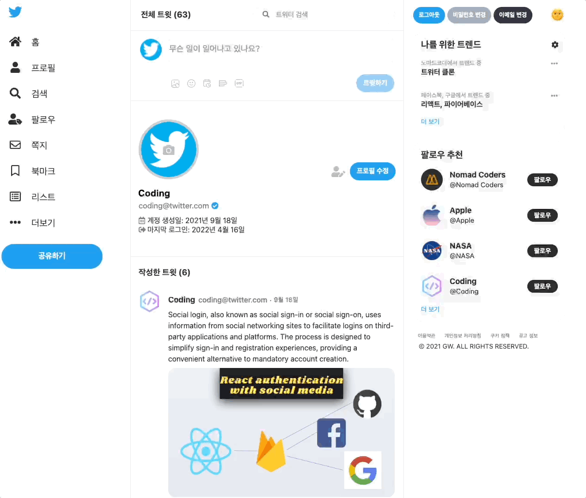
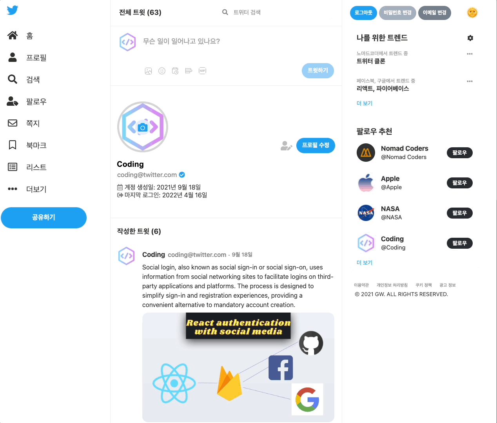
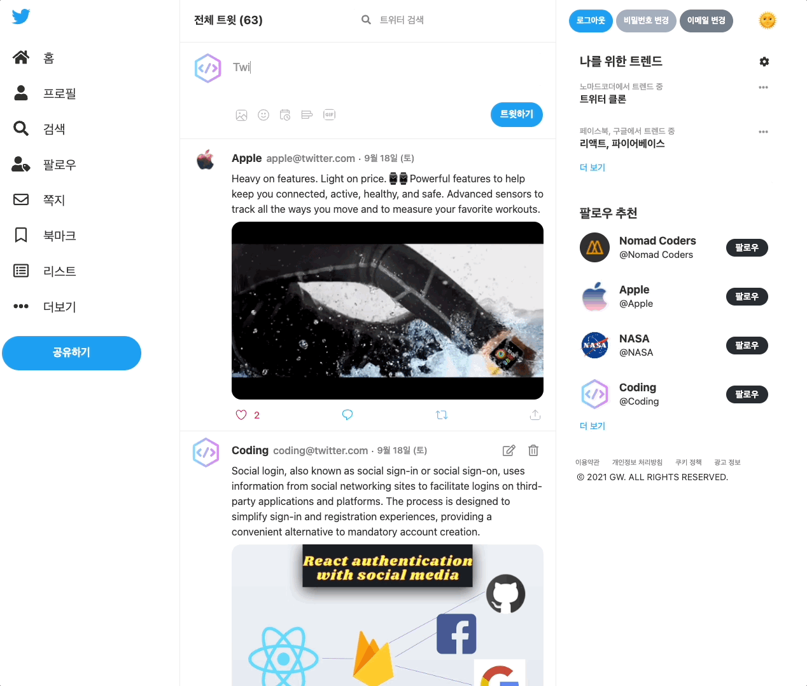
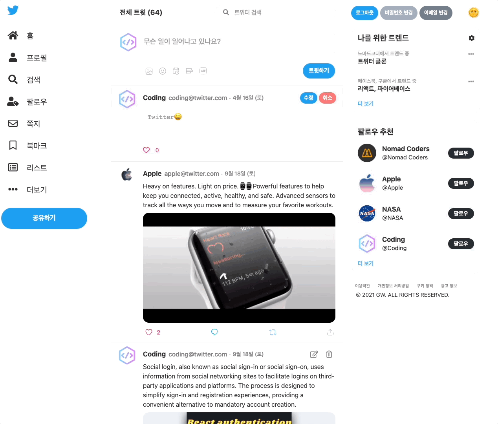

  <a href="http://githubgw.github.io/twitter-clone">
    
     
    <a display="block" href="http://githubgw.github.io/twitter-clone">http://githubgw.github.io/twitter-clone</a>
      
    
  </a>

## Table of contents

- 🔥 [Built with](#built-with)
- 🌈 [Project](#project)
- 📑 [Pages](#pages)
- ⚙ [Features](#features)
- 📝 [License](#license)

## Built with

### Front-end

- `React`
- `Javascript`
- `Styled Components`

### Back-end

- `Firebase`

### Deploy

- `GitHub`

## Project

> 1. 회원가입, 로그인

- 유저는 이메일, 비밀번호를 이용해 회원가입을 할 수 있습니다.
- 기존의 구글 또는 깃허브 계정을 이용해 소셜 로그인을 할 수 있습니다.
- 가입한 계정 정보는 파이어베이스의 `Authentication`에 저장됩니다.
    
  

> 2. 이메일 변경, 비밀번호 변경

- 유저는 현재 사용 중인 이메일을 새롭게 변경할 수 있습니다.
- 새로운 이메일 주소로 변경할 때, 기존 이메일을 통해 인증받아서 변경할 수 있습니다.
- 유저는 현재 사용 중인 비밀번호를 새롭게 변경할 수 있습니다.
    
  

> 3. 유저 프로필, 전체 트윗 확인

- 유저는 프로필 페이지에서 가입한 이메일 주소와 인증 여부, 계정 생성일, 마지막 로그인 날짜 등을 확인할 수 있습니다.
- 유저는 자신이 작성한 전체 트윗 리스트를 확인할 수 있습니다.
    
  

> 4. 프로필 수정 및 프로필 사진 업로드

- 유저는 프로필 페이지에서 유저 이름을 변경하고, 프로필 사진을 업로드할 수 있습니다.
- 업로드한 사진은 파이어베이스의 `Storage`에 저장됩니다.
    
  

> 5. 트윗 생성, 트윗 수정, 트윗 삭제

- 유저는 텍스트, 이미지 등을 넣어 트윗을 생성할 수 있습니다.
- 생성된 트윗은 유저 정보와 트윗 정보를 포함해서 파이어베이스의 `Firestore Database`에 저장됩니다.
- 유저는 자신이 작성한 트윗을 수정 및 삭제할 수 있습니다.
    
  

> 6. 좋아요, 좋아요 취소

- 유저는 모든 트윗에 좋아요 또는 좋아요 취소를 할 수 있습니다.
- 좋아요를 누르게 되면 파이어베이스의 `Firestore Database`에 저장되며, 실시간으로 좋아요 갯수를 업데이트합니다.
    
  

> 7. 전체 트윗 수, 다른 유저가 작성한 전체 트윗 확인

- 홈에서 현재 작성된 전체 트윗 수를 확인할 수 있습니다.
- 유저를 클릭해 다른 유저가 작성한 전체 트윗을 확인할 수 있습니다.
    
  

> 8. 플래시 메세지

- 유저가 회원가입, 로그인, 트윗, 프로필 업데이트 등의 동작을 실행할 때, 화면 오른쪽 상단에 작은 플래시 메세지를 보여줍니다.
- 플래시 메세지는 alert와 다르게 클릭하지 않아도 일정 시간이 지나면 자동으로 사라집니다.
    
  

> 9. 기타

- 2021년 9월 노마드코더에서 진행했던 트위터 클론 컨테스트에서 대상에 선정되어 애플워치를 받았습니다.
    
  

## Pages

> Root

- 홈
- 프로필

## Features

### 🙎‍♂️ User

- [x] 회원가입
- [x] 로그인 / 로그아웃
- [x] 구글 / 깃허브 로그인
- [x] 아바타 업로드
- [x] 프로필 수정
- [x] 이메일 변경
- [x] 비밀번호 변경

### 🧑‍💻 Tweet

- [x] 트윗 생성
- [x] 트윗 수정
- [x] 트윗 삭제
- [x] 트윗 확인
- [x] 좋아요, 좋아요 취소

## License

MIT
